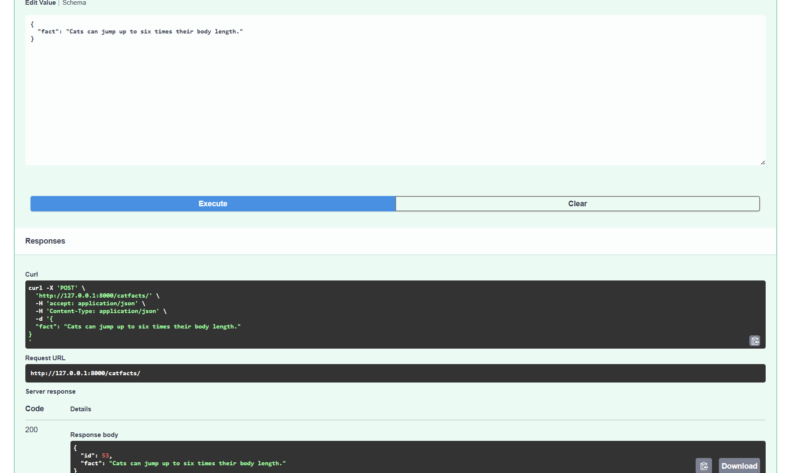

 Cat Facts Bonus API

 Introduction
The Cat Facts Bonus API is a **FastAPI backend application** that fetches, stores, and manages cat facts.  
It demonstrates the use of:

- FastAPI for API endpoints
- SQLAlchemy for database management
- Pydantic for data validation
- API key-based authorization for secure operations
- Rate limiting and caching
- Swagger UI for interactive API testing

The backend allows users to fetch cat facts from an external API, store them in a local database, and perform CRUD operations on the stored facts.

-----------------------------------------------------------

Project Structure
catfacts_bonus/
├─ main.py
├─ crud.py
├─ models.py
├─ schemas.py
├─ database.py
├─ requirements.txt
├─ README.md
├─ screenshots/
│ ├─ fetch_endpoint.png
│ ├─ swagger_docs.png
│ └─ demo_recording.mp4
└─ project_documentation/
├─ CatFacts_Project_Proposal.docx
└─ CatFacts_Design.pdf

-------------------------------------------------------------

Project Description

This project:

- Fetches cat facts from [`catfact.ninja`](https://catfact.ninja/)  
- Stores cat facts in a local SQLite database via SQLAlchemy  
- Supports CRUD operations (Create, Read, Update, Delete)  
- Implements rate limiting to prevent abuse (5 requests per minute per IP)  
- Implements caching with FastAPI Cache (responses cached for 60 seconds)  
- Secures certain endpoints with API key authentication  

------------------------------------------------------------------------------

 Steps to Build the Backend

1. **Setup Project Environment**
   - Create a virtual environment and install dependencies:
   ```bash
   pip install fastapi uvicorn sqlalchemy httpx fastapi-cache2 slowapi
   
2. Database Setup:
  . Used SQLAlchemy with SQLite for simplicity.
  . Defined a CatFact model with id and fact columns.

3. Create Pydantic Schemas:
  . CatFactCreateSchema – for creating a fact
  . CatFactSchema – for responses (includes id)

4. Implement CRUD Functions
  . crud.py contains:
    catfact_exists
    create_catfact
    get_catfacts
    get_catfact
    update_catfact
    delete_catfact
   
5. Build API Endpoints:
  . / – Root endpoint with welcome message
  . /fetch/ – Fetch cat facts from external API, store unique facts, return IDs and facts
  . /catfacts/ – CRUD endpoints with API key authorization for create/update/delete

6. Add Security:
  . API key-based authorization using FastAPI's HTTPBearer scheme
  . Rate limiting using slowapi (5 requests/minute)
  . Caching with fastapi-cache2

7. Test API
Interactive testing using Swagger UI:
http://127.0.0.1:8000/docs

--------------------------------------------

How to Run it:
1. Activate your virtual environment:
   # Windows
       venv\Scripts\activate
   # macOS/Linux
       venv/bin/activate
2. Run the FastAPI server:
       uvicorn main:app --reload

3. Access the API:
   Swagger UI: http://127.0.0.1:8000/docs
   Root endpoint: http://127.0.0.1:8000/
   
   ----------------------------------------------
API Testing with Swagger:

1. Fetch Cat Facts /fetch/

   . Set count query parameter to fetch multiple facts.
   . Returns unique facts stored in the database along with their IDs.

2. CRUD Operations /catfacts/

   . API key required (mysecretkey123) for POST, PUT, DELETE.
   . GET endpoints do not require authentication.
   . Use Swagger UI for interactive testing.

   ---------------------------------------------
   Screenshots

 Cat Facts API

**Cat Facts API** is a FastAPI project that allows users to create, read, update, delete, and fetch cat facts.  
This project demonstrates CRUD operations, authentication, caching, and rate limiting.

---

Demo & Screenshots

 1. Authentication


 2. Fetching Cat Facts (GET)


 3. Creating Cat Facts (POST)



 4. Updating Cat Facts (PUT)


 5. Deleting Cat Facts (DELETE)


 6. Advanced Features
  Rate Limits


 Cache Testing


GET after Delete


 7. Demo Video
[Watch full demo](Screenshots/20_demo.mkv)


</video>
